<div align="center">


<h1> Smart Calendar AI Agent - Azure Frontier Girls </h1>


[](https://azure.microsoft.com/)
[](https://ai.azure.com)
[](https://console.cloud.google.com)


[](https://github.com/biachristie/azure-agent-ai-calendar/stargazers)
[](https://github.com/biachristie/azure-agent-ai-calendar/watchers)
[](https://github.com/biachristie/azure-agent-ai-calendar/forks)

</div>
<br>

O projeto implementa uma ferramenta de *Function Calling* robusta para Agentes de IA (**Microsoft Foundry**). Construído sobre **Azure Functions** (Python), o sistema atua como um *middleware* que traduz intenções de linguagem natural em ações reais no **Google Calendar** e **Gmail**.

Esta solução gerencia o ciclo de vida completo da autenticação **OAuth2**, armazena tokens com segurança no **Azure Key Vault** e verifica conflitos de agenda (`freebusy`) antes de confirmar compromissos, garantindo que o agente nunca agende reuniões em horários ocupados.

O projeto está configurado para deploy contínuo via **GitHub Actions**.

<br>

## 🚀 Funcionalidades

* **Auth Seguro**: Implementação de OAuth2 com armazenamento de tokens no Key Vault.
* **Verificação de Conflitos**: Checa disponibilidade (`freebusy`) antes de agendar.
* **Agendamento Completo**: Cria o evento no Google Calendar e envia convites por e-mail via Gmail.
* **AI Ready**: Endpoint compatível com especificações OpenAPI para integração com Agentes de IA (ex: Microsoft Copilot/Foundry).

<br>

## 📋 Pré-requisitos

1. Conta no **Google Cloud Platform**.
2. Conta no **Microsoft Azure**.
3. Repositório GitHub com este código fonte.

<br>

## 🔨 Tecnologias Utilizadas

* Cloud: Microsoft Azure (Functions, Key Vault), Google Cloud Platform (Calendar & Gmail APIs).
* Linguagem: Python 3.10+.
* Bibliotecas Principais: azure-functions, azure-identity, azure-keyvault-secrets, google-api-python-client.
* DevOps: GitHub Actions (CI/CD).
* AI: Microsoft Foundry / Azure AI Studio.

<br>

## ☁️ Passo 1: Configuração do Google Cloud

1. Acesse o [Google Cloud Console](https://console.cloud.google.com/).

2. Clique em **Crie ou selecione um projeto** e crie um **Novo Projeto**.

3. Selecione o projeto criado - "Você está trabalhando em <PROJETO>" aparece na tela.

4. Clique em **API e Serviços**

5. Pesquise e ative as APIs **Google Calendar API** e **Gmail API** na guia **API e Serviços Ativados**.
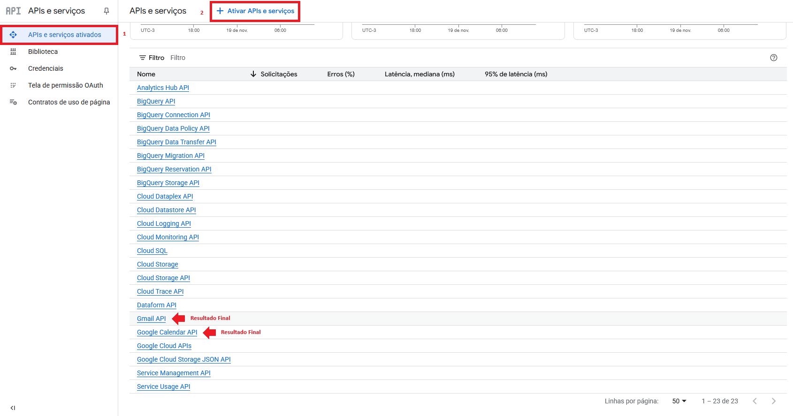

6. Configure a **Tela de permissão OAuth**:
    * Adicione um nome para o app e seu e-mail para suporte do usuário.
    * Escolha o público **Externo**
    * Adicione e-mail como dados de contato.
    * Adicione seu e-mail como usuário de teste.
    * Concorde com a política de dados.

7. Em **API e Serviços**, crie credenciais do tipo **ID do Cliente OAuth**:
    * **Tipo**: Aplicativo da Web.
    * Nome de sua escolha.
    * **URIs de Redirecionamento Autorizados**: Deixe em branco por enquanto (preencheremos após criar a Function na Azure).
        

8. ‼️**Baixe o JSON**: Salve o arquivo, pois ele será usado no Passo 2.

<br>

## 🛠️ Passo 2: Infraestrutura no Azure Portal

### Criar o Cofre de chaves (Key Vaults)
1. No Portal Azure, busque por **Cofre de Chaves** e clique em **Criar**.

2. Defina o **Grupo de Recursos**, o nome (ex: `kv-calendar-agent`) e a Região (ex: `East US 2`).
    * Caso ainda não tenha um recurso, clique em **Criar novo**

3. Revise e crie.

4. Após criado, entre no cofre criado, vá em **Objetos > Segredos** e gere os novos segredos:
    * **Nome**: `GOOGLE-CREDENTIALS-JSON`.
    * **Valor Secreto**: Cole todo o conteúdo do JSON baixado do Google (Passo 1).
    * **Nome**: `GOOGLE-OAUTH-TOKEN`.
    * **Valor Secreto**: "" (Será preenchido automaticamente)
    
    * Clique em **Criar**.  
        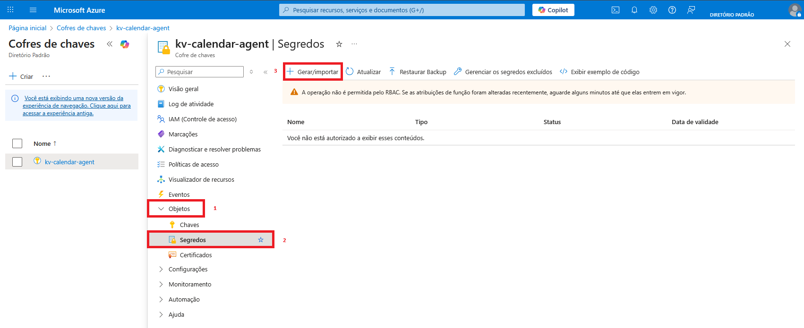


### Criar a Aplicativo de Funções (Function App)
1. Busque por **Aplicativo de Funções** e clique em **Criar**.

2. Configurações básicas:
    * **Planos de Hospedagem**: Consumo Flexível.
    * **Grupo de Recursos**: O mesmo recurso usado no Cofre de Chaves.
    * **Nome do Aplicativo de Funções**: Nomeie o aplicativo (ex: `calendar-agent-func`).
    * **Região**: Defina a região (ex: `East US 2`).
    * **Pilha de Runtime**: Python.
    * **Versão**: 3.10 ou superior (compatível com o `requirements.txt`).
    * **Conta de Armazenamento**: Escolha a conta ou crie uma nova caso não tenha.
    * **Autenticação**: Escolha **Segredos**  
    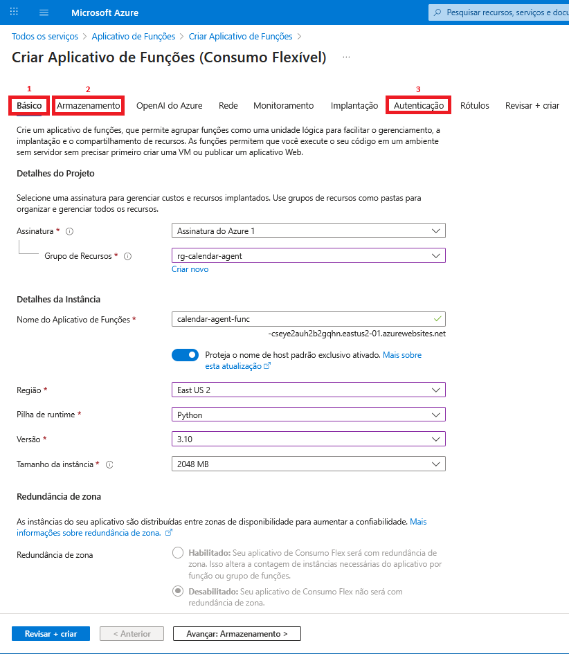

3. Prossiga e crie a função.

### Conceder Permissão (Identity)
A Function precisa de permissão para ler/escrever no Cofre de Chaves.
1. Na sua Function App, menu lateral **Configurações > Identidade (Identity)**.

2. Na aba **Sistema Distribuído**, mude o Status para **Ligar** e salve.  
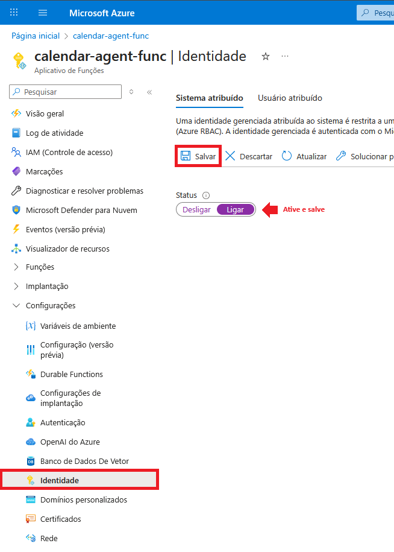

3. Volte ao seu **Cofre de Chaves**, selecione o seu cofre e clique em **IAM (Controle de Acesso)**.

4. Adicione uma atribuição de função.

5. Pesquise por **Usuário de segredos do cofre de chaves** e selecione.

6. Atribua o acesso a **Identidade Gerenciada**.

7. Adicione um membro: 
    * Identidade gerenciada: Escolha **Aplicativo de Funções**.
    * Selecione o app criado anteriormente.  
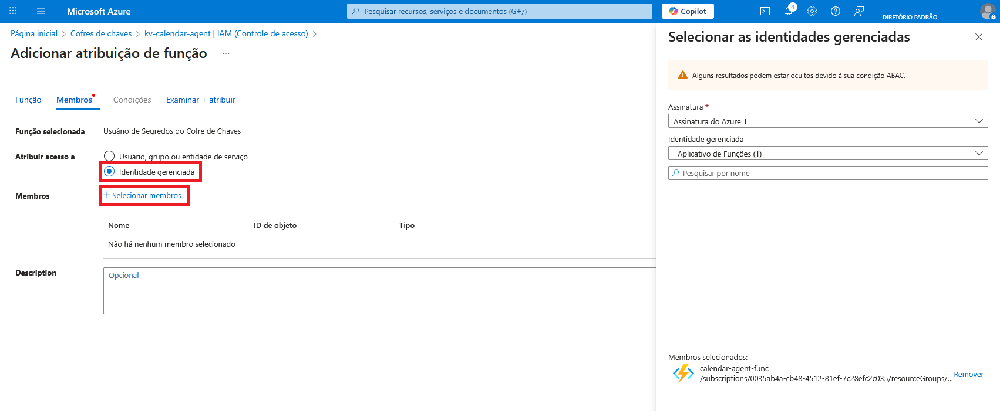

8. Examine e atribua.

9. Repita os mesmos procedimentos para a função **Responsável pelos segredos do cofre de chaves**.

10. Atribua um função **Administrador do cofre de chaves**, tipo **Usuário, grupo ou entidade de serviço**, à sua conta do Azure.

<br> 

## 🔄 Passo 3: Configuração do CI/CD (GitHub Actions)

1. No seu aplicativo de função no portal Azure, vá em **Implantação > Centro de Implantação**.
2. Em **Fonte**, selecione **GitHub**.
3. Autorize sua conta e selecione:
    * **Organização**: Conta do GitHub que contem o repositório.
    * **Repositório**: Repositório com os arquivos da função.
    * **Branch**: `feature/function-app` (criada dentro do repositório para ser usada no deploy).  
    

4. Clique em **Salvar**.
    * *O Azure criará automaticamente um arquivo de Workflow `.github/workflows/` no seu repositório e iniciará o deploy.*

5. No GitHub, modifique o workflow:
    ```
    ...

    env:
        AZURE_FUNCTIONAPP_PACKAGE_PATH: 'function_app'   # Coloque o local onde o calendar_agent está localizado dentro da branch

    ...

    - name: Install dependencies
      run: pip install -r ${{ env.AZURE_FUNCTIONAPP_PACKAGE_PATH }}/requirements.txt --target ${{ env.AZURE_FUNCTIONAPP_PACKAGE_PATH }}/.python_packages/lib/site-packages   # Instala as dependências de acordo com o requirements
    
    ...

    - name: Zip artifact for deployment
      run: |
        cd ${{ env.AZURE_FUNCTIONAPP_PACKAGE_PATH }}    # Muda o diretório para a localização correta
        zip -r release.zip ${{ env.AZURE_FUNCTIONAPP_PACKAGE_PATH }} -x "venv/*" -x "__pycache__/*"   # Empacota os arquivos

    ...

    ```

6. Build e deploy serão feitos automaticamente.

<br>

## ⚙️ Passo 4: Variáveis de Ambiente

A aplicação precisa saber onde está o Cofre de Chaves.

1. No seu aplicativo de função, vá em **Configurações > Variáveis de Ambiente**.

2. Adicione as seguintes variáveis:
    * **Nome**: `KEYVAULT_URI`
    * **Valor**: A URI do seu cofre de chaves (ex: `https://kv-calendar-agent.vault.azure.net/`).

3. (Opcional) Se você mudou os nomes padrões no código, defina também `KV_SECRET_NAME` e `KV_CREDENTIALS_NAME`.

4. Clique em **Aplicar**.

<br>

## 🔐 Passo 5: Autenticação OAuth

1. **Atualizar Google Cloud**:
    * Pegue o domínio padrão do seu aplicativo de funções localizado na visão geral (ex: `https://my-func-app.azurewebsites.net`).
    * Volte no Google Cloud Console > API e Serviços > Credenciais > seu Cliente OAuth.
    * Adicione em **URIs de redirecionamento autorizados** acrescido de `/api/oauth2callback` (ex: `https://my-func-app.azurewebsites.net/api/oauth2callback`).

2. **Autorizar a Aplicação**:
    * No navegador, acesse seu domínio padrão acrescido de `/api/oauth2init` (ex: `https://my-func-app.azurewebsites.net/api/oauth2init`).
    * Faça *login* com sua conta Google e autorize.
    * Você verá a mensagem de sucesso indicando que o token foi salvo no seu Cofre de Chaves ("OAuth complete - token saved in Key Vault. You can close this page.").

3. No seu aplicativo de função, selecione a função criada e execute um teste:
    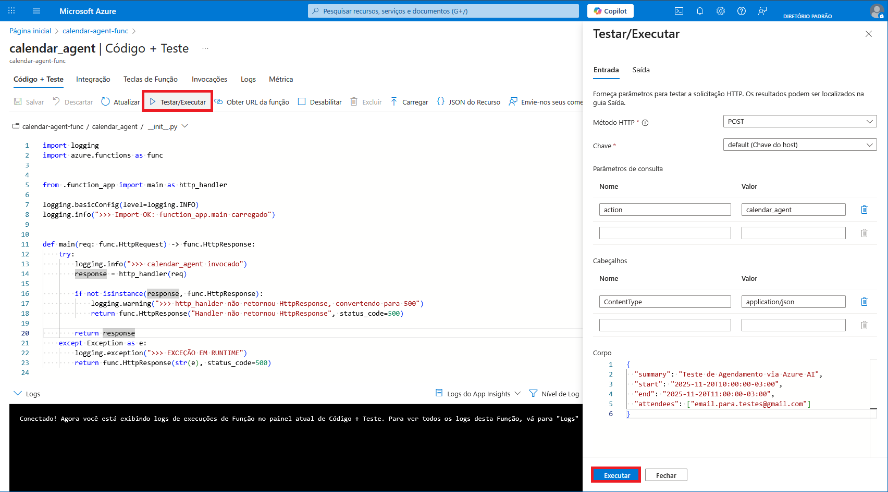

    * **Método HTTP**: POST.
    * **Chave**: default(Chave do host)
    * Parâmetros de consulta:
        * **Nome**: action
        * **Valor**: calendar_agent
    * Cabeçalhos:
        * **Nome**: ContentType
        * **Valor**: application/json
    * Corpo:
        ```
            {
                "summary": "Teste de Agendamento via Azure AI",
                "start": "2025-11-20T10:00:00-03:00",
                "end": "2025-11-20T11:00:00-03:00",
                "attendees": ["email.para.testes@gmail.com"]
            }
        ```  

4. O código de resposta HTTP esperado é **200 OK**.

<br>

## 🤖 Passo 6: Integração no Microsoft Foundry (Azure AI Foundry)

1. No **Microsoft Foundry**, crie um novo Agente.  
    * Crie um projeto:
        * **Projeto**: Nomeie o projeto (ex: `SmartCalendar`).
        * **Grupo de Recursos**: Escolha o mesmo recurso usado no Azure.
        * **Recurso da Fábrica de IA do Azure**: Nomeie o recurso (`calendar-agent-ai-resource`).
        * **Região**: Escolha a região (ex: `East US 2`).  
        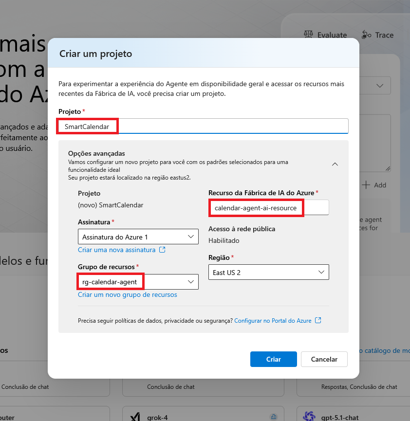

    * Implante um modelo:
        * Escolha um modelo (ex: `gpt-4o-mini`).
        * **Tipo de Implantação**: Standard.
        * **Recurso de IA Conectado**: Recurso criado.  
        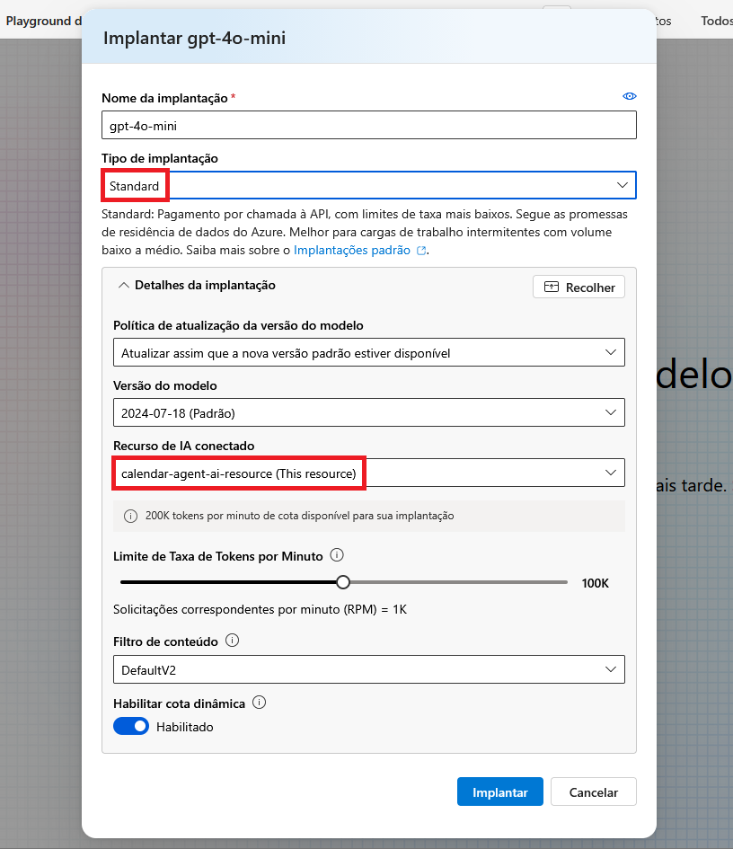
    
2. **Instruções**: Copie o conteúdo do arquivo `system_prompt.txt`.  
   * *Atenção*: O prompt instrui o modelo sobre fuso horário (`America/Sao_Paulo`) e formato de dados.

3. **Descrição do Agente**: Adicione uma breve descrição (ex: "Um assistente inteligente que gerencia o calendário Google para agendamento de reuniões, utilizando a ferramenta 'calendar_agent'.")

4. **Ações**:
    * Selecione "Aplicativos Lógicos do Azure".
    * Escolha a ação "Call external HTTP or HTTPS endpoints".
    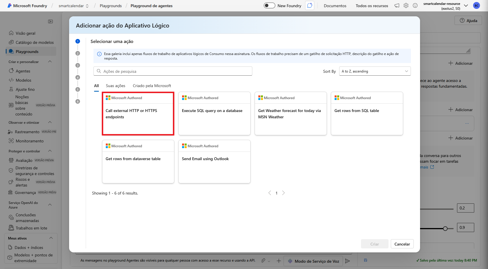
    * **Nome da Ação**: Nomeie a ação do agente (ex: `smartcalendar_agent`).
    * **Descrição da Ação**: Adicione uma breve descrição.
    * **Resource Group**: Selecione o grupo de recursos do Azure.  
    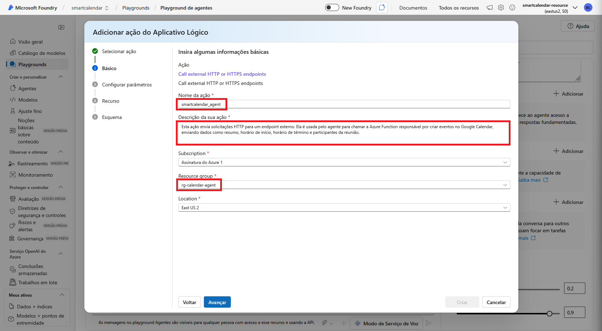
    * Selecione POST em **HTTP Method for the endpoint**.
    * Confirme a conexão a um Serviço de Aplicativos Lógicos do Azure.
    * Descreva como invocar a ferramenta (ex: "Chame esta ferramenta enviando HTTP_URI com a URL da Function e HTTP_request_content com o JSON do agendamento (summary, start, end, attendees).")
    * Substitua o **Esquema** pelo conteúdo do `openapi.json`.
        * Adicione à `url` o domínio do seu aplicativo de função (ex: `https://my-func-app.azurewebsites.net`).
        * Certifique-se de que o `path` e o `operationId` tem o nome da sua função.

5. **Configurações do Modelo**:
    * **Temperatura**: Entre 0.1 e 0.3 a fim de garantir que o agente seja preciso e não invente datas ou horários.
    * **Top P**: Entre 0.8 e 1.0 para que o agente converse com o usuário de maneira natural, com fluidez.
    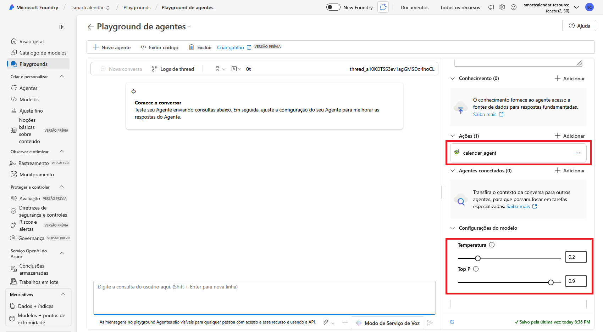

<br>

## 7. 👀 Exemplo de Uso
No chat do agente, digite: "Agende uma reunião de acompanhamento com Fulano (cliente@email.com) para amanhã às 15h."
O agente irá:
1. Interpretar "amanhã" baseado na data atual.
2. Chamar a Function `/api/calendar_agent`.
3. Confirmar o agendamento com o *link* da reunião.

<br>


<br>

## 📁 Estrutura do Projeto
```
    smart-calendar-agent/              # Raiz do Repositório
    │
    ├── ai_agent_foundry/              # Pasta do Agente
    │   ├── openapi.json               # Definição da API para o AI Agent (Foundry)
    │   └── prompt_system.txt          # Instruções do Sistema (Prompt Engineering)
    │
    ├── function_app/                  # Pasta da Função
    │   ├── calendar_agent
    │   │   ├── __init__.py            # Ponto de entrada (entryPoint)
    │   │   ├── function_app.py        # Lógica principal (OAuth, Google, etc.)
    │   │   ├── function.json          # Definição de gatilhos e bindings
    │   │   └── host.json
    │   ├── host.json                  # Configuração global da Function App
    │   └── requirements.txt           # Bibliotecas Python necessárias
    │
    ├── images/
    │
    ├── .gitignore                     
    └── README.md                      
```

<br>

## 💰 Custos do Projeto

O projeto foi desenhado utilizando arquitetura **Serverless** (Azure Functions Consumption Plan), o que garante custo zero enquanto o sistema está ocioso, ao mesmo tempo que a camada de inteligência utiliza recursos do **Azure Machine Learning**. O **Machine Learning** foi o responsável pela maior parte do investimento, ainda que o custo total permaneça extremamente baixo.

<br>

**Resumo de Custos (Novembro/2025):**

Serviço (Azure) | Recurso | Custo (BRL) | Detalhes |
| :--- | :--- | :--- | :--- |
| **Azure Machine Learning** | `workspace...` | R$ 3,31 | Custo de computação/instância para o Agente de IA. |
| **Storage Accounts** | `stcalendar...` | R$ 0,09 | Logs, artefatos de build e retenção de dados. |
| **Cognitive Services** | `cognitiveserv...` | R$ 0,01 | Chamadas de API para serviços de IA. |
| **Key Vault** | `kv-calendar...` | < R$ 0,01 | Operações de leitura de segredos/transações. |
| **Azure App Service** | `func-calendar...` | R$ 0,00 | Coberto pelo *Free Grant* do plano de consumo. |
| **TOTAL** | | **R$ 3,41** | |

> *\*Valores baseados na tabela de preços da região East US 2. O plano de consumo concede 400.000 GB-s de memória e 1 milhão de execuções gratuitas por mês.*

<br>

## 🫱🏿‍🫲🏻 Licença
Este código está sob a Licença MIT, cujo texto pode ser lido em [MIT License](https://github.com/biachristie/azure-agent-ai-calendar/blob/main/LICENSE.md).

<br>

## 🧠 Criado por
Projeto desenvolvido por Beatriz Christie © 2025